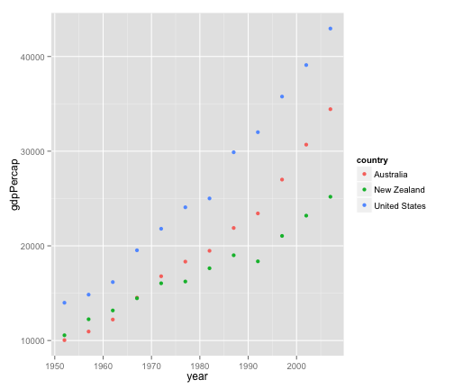
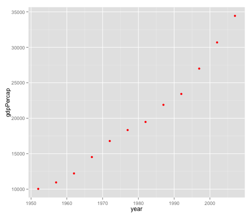
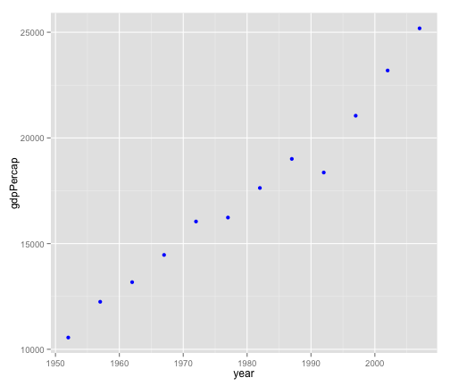
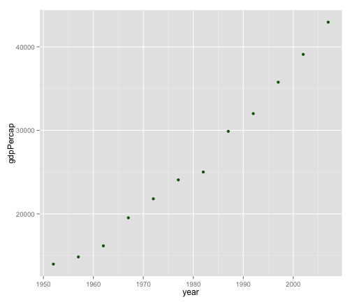

RMD file - exercise
========================================================

This is an R Markdown document. Markdown is a simple formatting syntax for authoring web pages (click the **Help** toolbar button for more details on using R Markdown).

When you click the **Knit HTML** button a web page will be generated that includes both content as well as the output of any embedded R code chunks within the document. You can embed an R code chunk like this:


```r
data <- read.delim("gapminder.txt")

library('reshape2')
library('ggplot2')
library(RColorBrewer)
Australia <- subset(data, country=="Australia")
New_Zealand <- subset(data, country=="New Zealand")
United_states <- subset(data, country=="United States")

three_countries <- subset(data, country=="Australia" | country=="New Zealand" | country=="United States")

plot_three_countries <- ggplot(three_countries, aes(x=year, y=gdpPercap, colour=country)) + geom_point(size=2) + scale_fill_brewer(palette='Set1')  
  
plot_Australia <- ggplot(Australia, aes(x=year, y=gdpPercap)) + geom_point(size=2, colour = "red")
plot_New_Zealand <- ggplot(New_Zealand, aes(x=year, y=gdpPercap)) + geom_point(size=2, colour = "blue")
plot_United_states <- ggplot(United_states, aes(x=year, y=gdpPercap)) + geom_point(size=2, colour = "dark green")
```

You can also embed plots, for example:


```r
plot(plot_three_countries)
```

 

```r
plot(plot_Australia)
```

 

```r
plot(plot_New_Zealand)
```

 

```r
plot(plot_United_states)
```

 

